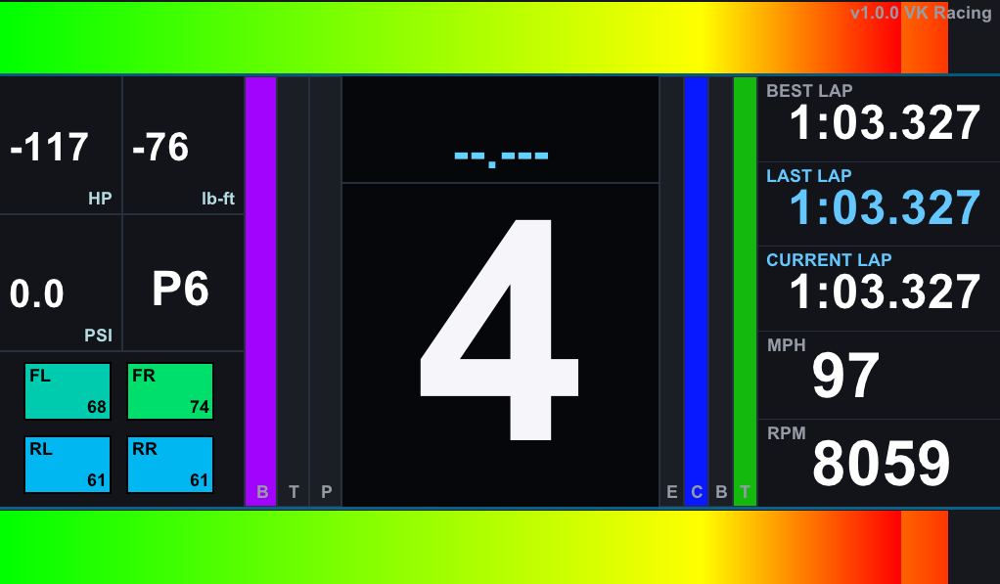

# Forza Horizon 6 Sim Dashboard

Racing telemetry dashboard for **Forza Horizon 6** (Zig 0.16.0).



## Features

- Graphical dashboard (raylib) inspired by the AC/Python reference layout
- Official FH6 UDP packet (324 bytes) including `CarGroup` / smashable fields
- Defaults: **127.0.0.1:20067**, **mph**, **HP**, **lb-ft**, **°F**
- Optional terminal mode (`--terminal`)

## Setup

1. Install [Zig 0.16.0](https://ziglang.org/download/)
2. In FH6: **Settings → HUD and Gameplay → Data Out**
   - IP: `127.0.0.1`
   - Port: `20067`
3. Build and run:

```bash
zig build run
```

First build downloads and compiles raylib (may take a few minutes).

## Options

```bash
zig build run -- --help
zig build run -- --imperial          # default
zig build run -- --metric            # km/h, kW, Nm, °C
zig build run -- --pos 1242,1440     # window position
zig build run -- --font C:/Windows/Fonts/arialbd.ttf
zig build run -- --terminal          # text-only fallback
zig build run -- --only-racing
```

## Layout

- Gradient RPM bar (top)
- Tyre temperature grid (color-coded)
- Large center gear with redline flash
- Speed / RPM readouts
- Throttle & brake bars
- Lap times and position
- Power (HP) and torque (lb-ft)


** THIS IS ALL VIBE CODED, BE WARNED **
